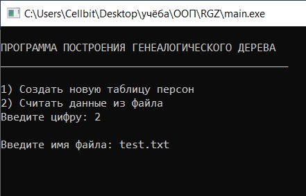
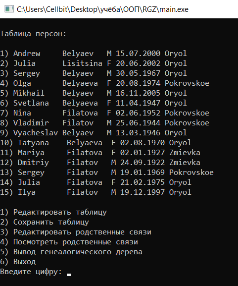
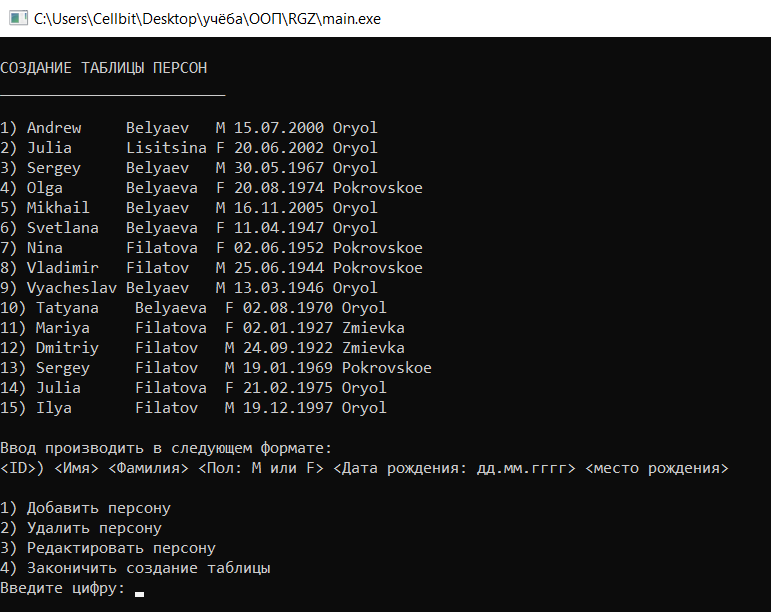
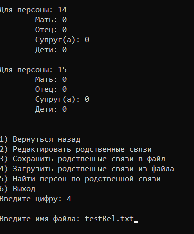
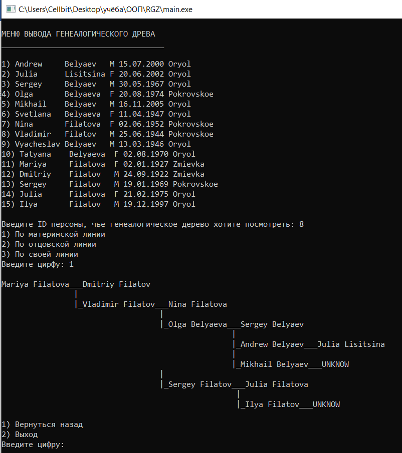
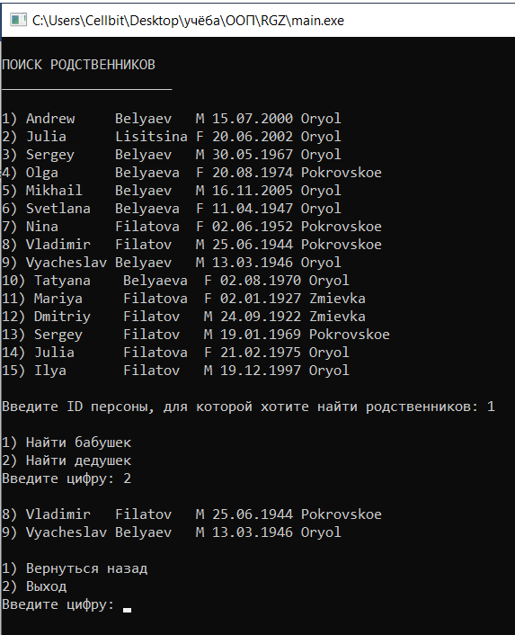
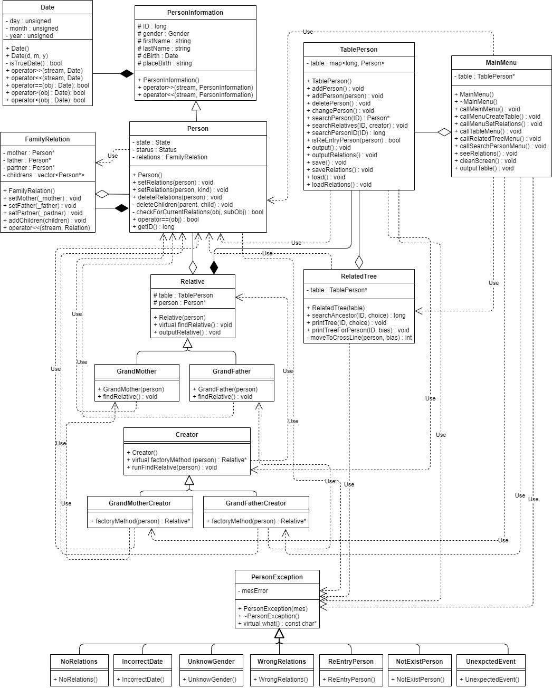

# Консольное приложение для построения генеалогического древа

Программа обеспечивает возможность ввода информации о людях, состоящих в родстве друг с другом (пол, дата рождения, место рождения, и т.п.). Для каждого человека есть возможность указания его родителей, детей. Для регистрации изменений в программе предусмотрены операции различного типа: установление родства (в том числе и женитьба), добавление людей в таблицу данных и редактирование информации о них, а также возможность сохранения информации таблицы персон и родственных связях внутри нее в файл, для последующего восстановления и работы с ней. (информация о родственных связях сохраняется в отдельный файл, который должен быть загружен так же отдельно! Формат файла .txt). По данным о родственных связях программа обеспечивает вывод на экран генеалогического дерева в псевдографической форме.

# Скриншоты работы программы

# Диаграмма классов, использованных в программе

___
Для того, чтобы проверить работоспособность программы загрузите два тестовых файла: test.txt (файл с данными о персонах) и testRel.txt (файл родственных связей). Для того чтобы загрузить файл с родственными связями: перейдите в меню "просмотр родственных связей" (п.4), и далее "загрузить родственные связи из файла" (п.4)  